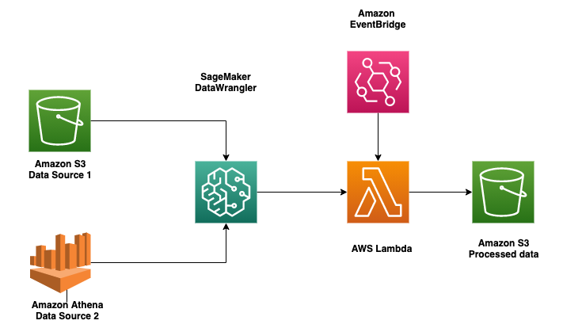

# How to schedule Amazon SageMaker Data Wrangler flow to process new data periodically using AWS Lambda Functions

This code is to accompany the [blog post](update with the link).

This blog will demonstrate how to schedule your data preparation to run automatically leveraging [AWS Lambda](https://aws.amazon.com/lambda/) and an existing Data Wrangler flow file. [AWS Lambda](https://aws.amazon.com/lambda/) is a serverless compute service that lets you run your code with right execution power and zero administration. This post assumes you have an existing .flow file from your processing step using Amazon SageMaker Data Wrangler. 

Please follow along the [blog](add link) to use an existing .flow file to schedule preprocessing steps. Here is a simple architecture diagram that shows the entire process.

The accompanying code within lambda_function.py is an example how to structure the script for AWS Lambda function. Please note, this needs to be updated with specific .flow file, data source location, IAM role, and other parameters for data processing as explained in the blog post. The blog explains how to prepare this script from an existing SageMaker DataWrangler .flow file, creat the AWS Lambda function, and schedule the AWS Lambda function using Amazon EventBridge from AWS Console GUI with out any additional code. 

### Disclaimer

We used the public data from [cms.gov](https://www.cms.gov/Research-Statistics-Data-and-Systems/Downloadable-Public-Use-Files/SynPUFs/DE_Syn_PUF) to create our demo .flow file to show an example where real data can come at regular interval with similar data model requiring scheduled preprocessing job for ML use case. 

### Citation

Centers for Medicare & Medicaid Services. (2018). 2019 Health Insurance Exchange Public Use Files (Medicare Claims Synthetic Public Use Files) [[Data file](https://www.cms.gov/Research-Statistics-Data-and-Systems/Downloadable-Public-Use-Files/SynPUFs/Downloads/SynPUF_DUG.pdf) and [code book](https://www.cms.gov/files/document/de-10-codebook.pdf-0)]. Retrieved from https://www.cms.gov/Research-Statistics-Data-and-Systems/Downloadable-Public-Use-Files/SynPUFs/DE_Syn_PUF

**This Medicare Claims Synthetic Public Use Files is made available under the Open Database License: [http://opendatacommons.org/licenses/odbl/1.0/](https://opendatacommons.org/licenses/odbl/1.0/). Any rights in individual contents of the database are licensed under the Database Contents License: [http://opendatacommons.org/licenses/dbcl/1.0/](https://opendatacommons.org/licenses/dbcl/1.0/)**

## My Project

TODO: Fill this README out!

Be sure to:

* Change the title in this README
* Edit your repository description on GitHub

## Security

See [CONTRIBUTING](CONTRIBUTING.md#security-issue-notifications) for more information.

## License

This library is licensed under the MIT-0 License. See the LICENSE file.

